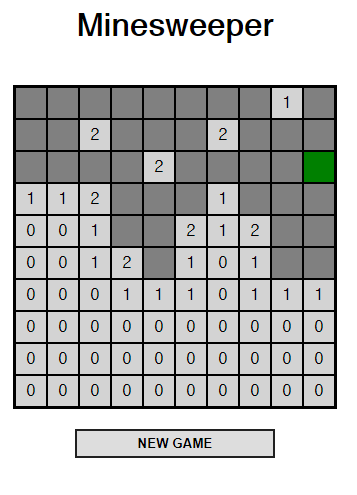

# Vue Minesweeper



Very **very** simple VueJS Minesweeper implementation for the sole purpose of learning Vue.

It's a good library.

## How to run:
```
npm install
npm run serve
```

### Build and minify for production:
```
npm run build
```

### Apply linter to the project:
```
npm run lint
```